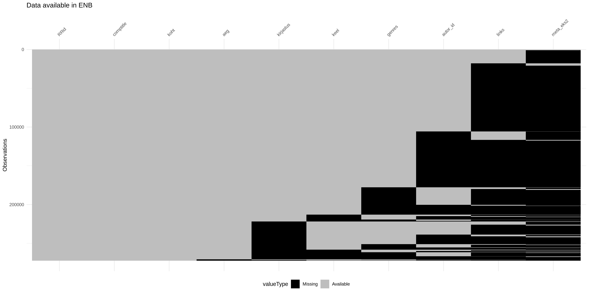

## ENB metadata


### Abstract

Estonian National Bibliography is a metadata set that aims to collect information on all publications written in any language in Estonia and all texts written in Estonian in whichever country. The dataset has been compiled in digital format since 2002 and aggregates the work of multiple institutions and generations in collecting the publication information.

The data here has been extracted on Jan 27 2022.

This dataset presents the Estonian National Bibliography dataset in wide instead of long format used in Marc21, with some of the variables that may be useful for text-mining studies. It includes the following information

- publication ID in National Library
- time of publication (aeg)
- place of publication (koht_raw)
- partly standardized place of publication (koht)
- publisher (kirjastus_raw)
- partly standardized publisher information (kirjastus)
- title (title, subtitle, comptitle)
- author (name, date of birth,id)
- other associated authors (translator, editor etc)
- number of copies printed
- font information
- keyword
- genre
- link to fulltext

Information on coding the variables can be found here: [meta file on github]

Helpful information on the metadata available can be found here: http://data.digar.ee/#page5

The rules followed in adding information on older books can be found here: https://www.elnet.ee/wiki/lib/exe/fetch.php?media=kataloogimine:vanaraamatmarc_2019.pdf


## Intro

The current code organizes the ENB metadata into a [tidy](https://cran.r-project.org/web/packages/tidyr/vignettes/tidy-data.html) format: with one publication per line, and with the basic metadata information distributed into few relevant categories. This has been done to facilitate further data analytic steps, particularly when someone may be unfamiliar with Marc21 database structures.

```{r setup,echo=F}
knitr::opts_knit$set(root.dir = rprojroot::find_rstudio_root_file())
```

```{r setup2, echo=F, warning=F,results='hide', include=FALSE}
library(here)
library(data.table)
library(tidyverse)
library(plotly)
library(naniar)
options(scipen=99999)
cbPalette <- c("#999999", "#E69F00", "#56B4E9", "#009E73", "#F0E442", "#0072B2", "#D55E00", "#CC79A7")
cbbPalette <- c("#000000", "#E69F00", "#56B4E9", "#009E73", "#F0E442", "#0072B2", "#D55E00", "#CC79A7")
morecolours <- c("#8dd3c7","#ffffb3","#bebada","#fb8072","#80b1d3","#fdb462","#b3de69","#fccde5","#d9d9d9","#bc80bd","#ccebc5","#ffed6f")

library("rnaturalearth")
#library("rnaturalearthdata")
library(sf)
#library(rgeos)
#install.packages(c("cowplot", "googleway", "ggplot2", "ggrepel", 
#"ggspatial", "libwgeom", "sf", "rnaturalearth", "rnaturalearthdata"))
```


## Summary

```{r read the metadata from file for speed, echo=F, warning=F}
works <- fread(cmd="unzip -p data/ENB_works.tsv.zip",sep="\t")
works_et <- works[set=="eesti"]


```


The dataset has altogether information on `r nrow(works)` printed items. The coverage has been estimated to be better than 95% for all of the relevant published works.

The dataset is divided into two: works in Estonian language, and works in other languages. The two sets are displayed over the year of publication here in different colors.

```{r summary data, echo=F, warning=F, fig.height=4, fig.width=8}

#nrow(works)

works[aeg< 1800&aeg>1600] %>%
  ggplot(aes(x=aeg,fill=set))+geom_histogram(binwidth=1)+
  theme_bw()+
  scale_fill_manual(values=cbPalette)+
  labs(y="",x="")
works[aeg< 2020&aeg>1800] %>%
  ggplot(aes(x=aeg,fill=set))+geom_histogram(binwidth=1)+
  theme_bw()+
  scale_fill_manual(values=cbPalette)+
  labs(y="",x="")

#summary(works$aeg)

#maybe colour main overview by era?

```


## Coverage of metainformation


```{r coverage of metainformation, echo=F, warning=F, fig.height=8, fig.width=16, eval =T}

#vis_miss(as.tibble(works[,.(RRid,aeg,koht,kirjastus,autor_id,comptitle,meta_eks2,keel,genres, links)]),cluster=T,sort_miss=F,warn_large_data = F)


works[works==""|works==" "]<-NA

#nabular(works[,.(RRid,aeg,koht,kirjastus,autor_id,comptitle,meta_eks2,keel,genres, links)])

NA_table <- data.table(as_shadow(works[,.(RRid,aeg,koht,kirjastus,autor_id,comptitle,meta_eks2,keel,genres, links)]))
names(NA_table)<- c("RRid","aeg","koht","kirjastus","autor_id","comptitle","meta_eks2","keel","genres", "links")
NA_table <- NA_table[order(RRid,comptitle,koht,aeg,kirjastus,keel,genres,autor_id,links,meta_eks2)]
#"RRid","comptitle","koht","aeg","kirjastus","keel","genres","autor_id", "links","meta_eks2"

#vis_dat(NA_table)

#NA_table[,.N,.(RRid,aeg,koht,kirjastus,autor_id,comptitle,meta_eks2,keel,genres, links)]

vis_gather_ <- function(x){
  x %>%
  dplyr::mutate(rows = dplyr::row_number()) %>%
    tidyr::gather_(key_col = "variable",
                   value_col = "valueType",
                   gather_cols = names(.)[-length(.)])
}


fingerprint <- function(x){

  # is the data missing?
  ifelse(is.na(x),
         # yes? Leave as is NA
         yes = NA,
         # no? make that value no equal to the class of this cell.
         no = paste(class(x), collapse = "\n")
  )
}


#fingerprinted <- works[,.(RRid,aeg,koht,kirjastus,autor_id,comptitle,meta_eks2,keel,genres, links)] %>%
#  purrr::map_df(fingerprint) %>%
#  vis_gather_()

gathered <- vis_gather_(NA_table)

gathered_DT <- data.table(gathered)
gathered_DT[,variable:=factor(variable,levels=c("RRid","comptitle","koht","aeg","kirjastus","keel","genres","autor_id", "links","meta_eks2"))]

vis_pal_cb_safe <- c('#d73027', # red
                         '#fc8d59', # orange
                         '#fee090', # yellow
                         '#e0f3f8', # light blue
                         '#91bfdb', # mid blue
                         '#4575b4') # dark blue

variables_overview <-data.table(gathered)[,.N,.(valueType,variable)][,sum:=sum(N),variable][valueType=="!NA"][,prop:=round(N/sum,2)*100,variable]
variables_overview

```


An overview of the coverage of the data is given below. Grey areas indicate datapoints that do have the information of that column, black areas the datapoints that do not have the information of that column. For example `r variables_overview[variable=="kirjastus",prop]`% of the books have information on the publisher, however just `r variables_overview[variable=="autor_id",prop]`% of the books have information on the author. `r variables_overview[variable=="links",prop]`% of the books have a link to an online digital copy.


```{r, echo=F, warning=F, fig.height=8, fig.width=12,include=F}

missingness_p <- gathered_DT %>%
  ggplot()+
  geom_tile(aes(x=variable,y=rows,fill=valueType))+
  theme_minimal() +
  theme(axis.text.x = ggplot2::element_text(angle = 45,
                                                     vjust = 1,
                                                     hjust = 1)) +
  labs(x = "",  y = "Observations", title="Data available in ENB") +
    # flip the axes
    scale_y_reverse() +
  theme(axis.text.x = ggplot2::element_text(hjust = 0.5))+
  scale_fill_manual(limits = c("!NA","NA"),
                               breaks = c("!NA","NA"), # dark blue
                               values = c("grey","black"),#vis_pal_cb_safe,
                    labels=c("Available","Missing"),
  na.value = "grey") +
    ggplot2::guides(fill = ggplot2::guide_legend(reverse = TRUE)) +
    ggplot2::theme(legend.position = "bottom") +
    # fix up the location of the text
  ggplot2::theme(axis.text.x = ggplot2::element_text(hjust = 0))+
  ggplot2::scale_x_discrete(position = "top")

#keel to keywords
#change names to something gathered...


  #d <- NA_table %>%
    #purrr::map_df(fingerprint) %>%
    #vis_gather_() %>%
    # get the values here so plotly can make them visible
    #dplyr::mutate(value = vis_extract_value_(x))

ggsave("plots/missingness_p.png",missingness_p,height=8,width=16)

```




### Cities

The city names where the works have been published have been harmonized manually and through a few heuristic algorithms. The tokens that appear more than 40 times should be mostly harmonized, while rarer tokens have been included only through algorithmic processing. Depicted below are the most common cities of publication and the number of publications in them separately for language sets.


```{r plot cities, echo=F, warning=F, fig.height=4, fig.width=8}
#Eesti is correct now, there's no information on cities on Eesti examples
#see2 <- less[str_detect(koht,"Eesti")]
#see <- set_unique[!is.na(koht)&koht!=""][,.N,by=koht]

#all cities with more than 10 books in corpus
plotdata_kohad <- works[!is.na(koht)&koht!=""][,.N,by=koht][order(N)][N>200]
 
plotdata_kohad %>%
    ggplot(aes(y=N,x=fct_reorder(koht,N)))+
    geom_bar(stat="identity",position="dodge")+
    geom_text(data=plotdata_kohad[(nrow(plotdata_kohad)-1):nrow(plotdata_kohad)], aes(label=N),size = 3, position = position_stack(vjust = 1.05))+
    geom_text(data=plotdata_kohad[!(nrow(plotdata_kohad)-1):nrow(plotdata_kohad)],aes(label=N),size = 3, hjust = -0.5)+# )+
    #coord_cartesian(ylim=c(0,2700))+
    coord_flip()+
    theme_bw()+
    scale_y_log10()+
    labs(x="",y="")+
    NULL
    
plotdata_kohad <- works[!is.na(koht)&koht!=""][,.(N=.N),by=.(koht,set)][,sum_N:=sum(N),by=koht][order(sum_N)][,koht:=factor(koht,levels=unique(koht))][sum_N>200]

plotdata_kohad %>%
    ggplot(aes(y=N,x=koht,fill=fct_rev(set)))+
    geom_bar(stat="identity")+
    geom_text(data=plotdata_kohad[(nrow(plotdata_kohad)-1):nrow(plotdata_kohad)], aes(label=N,y=N),size = 3, position = position_stack(vjust = 1.05))+
    geom_text(data=plotdata_kohad[!(nrow(plotdata_kohad)-1):nrow(plotdata_kohad)],aes(label=N,y=N),size = 3, hjust = -0.5)+# )+
    #coord_cartesian(ylim=c(0,2700))+ [,.SD[1],koht][,.SD[1],koht]
    coord_flip()+
    theme_bw()+
    labs(x="",y="")+
    scale_y_log10()+
    facet_wrap(~set,ncol=2,scales="free_y")+
    NULL
```


### Authors


```{r plot authors, echo=F, warning=F, fig.height=4, fig.width=8}
plotdata_autorid <- works[!is.na(autor_id)&autor_id!=""][,.N,by=autor_id][order(N)][,autor_id:=factor(autor_id,levels=unique(autor_id))][N>170]
plotdata_autorid %>%
    ggplot(aes(y=N,x=autor_id))+
    geom_bar(stat="identity",position="dodge")+
    geom_text(data=plotdata_autorid[(nrow(plotdata_autorid)-1):nrow(plotdata_autorid)], aes(label=N),size = 3, position = position_stack(vjust = 1.05))+
    geom_text(data=plotdata_autorid[!(nrow(plotdata_autorid)-1):nrow(plotdata_autorid)],aes(label=N),size = 3, hjust = -0.5)+# )+
    #coord_cartesian(ylim=c(0,2700))+
    coord_flip()+
    theme_bw()+
    labs(x="",y="",title="Most common authors in the bibliography")+
    NULL

plotdata_autorid <- works[set=="eesti"][!is.na(autor_id)&autor_id!=""][,.N,by=autor_id][order(N)][,autor_id:=factor(autor_id,levels=unique(autor_id))][N>120]
plotdata_autorid %>%
    ggplot(aes(y=N,x=autor_id))+
    geom_bar(stat="identity",position="dodge")+
    geom_text(data=plotdata_autorid[(nrow(plotdata_autorid)-1):nrow(plotdata_autorid)], aes(label=N),size = 3, position = position_stack(vjust = 1.05))+
    geom_text(data=plotdata_autorid[!(nrow(plotdata_autorid)-1):nrow(plotdata_autorid)],aes(label=N),size = 3, hjust = -0.5)+# )+
    #coord_cartesian(ylim=c(0,2700))+
    coord_flip()+
    theme_bw()+
    labs(x="",y="",title="Most common authors in the Estonian language set")+
    NULL

plotdata_autorid <- works[set=="muukeelne"][!is.na(autor_id)&autor_id!=""][,.N,by=autor_id][order(N)][,autor_id:=factor(autor_id,levels=unique(autor_id))][N>70]
plotdata_autorid %>%
    ggplot(aes(y=N,x=autor_id))+
    geom_bar(stat="identity",position="dodge")+
    geom_text(data=plotdata_autorid[(nrow(plotdata_autorid)-1):nrow(plotdata_autorid)], aes(label=N),size = 3, position = position_stack(vjust = 1.05))+
    geom_text(data=plotdata_autorid[!(nrow(plotdata_autorid)-1):nrow(plotdata_autorid)],aes(label=N),size = 3, hjust = -0.5)+# )+
    #coord_cartesian(ylim=c(0,2700))+
    coord_flip()+
    theme_bw()+
    labs(x="",y="",title="Most common authors among the publications not in Estonian")+
    NULL


```

### Publishers

Publisher names have also been harmonized manually and algorithmically with more frequent names in focus. 

```{r plot publishers, echo=F, warning=F, fig.height=4, fig.width=8}

plotdata_kirjastus <- works[!is.na(kirjastus)&kirjastus!=""][,.N,by=kirjastus][order(N)][,kirjastus:=factor(kirjastus,levels=unique(kirjastus))][N>1000]
plotdata_kirjastus %>%
    ggplot(aes(y=N,x=kirjastus))+
    geom_bar(stat="identity",position="dodge")+
    geom_text(data=plotdata_kirjastus[(nrow(plotdata_kirjastus)-1):nrow(plotdata_kirjastus)], aes(label=N),size = 3, position = position_stack(vjust = 1.05))+
    geom_text(data=plotdata_kirjastus[!(nrow(plotdata_kirjastus)-1):nrow(plotdata_kirjastus)],aes(label=N),size = 3, hjust = -0.5)+# )+
    #coord_cartesian(ylim=c(0,2700))+
    coord_flip()+
    theme_bw()+
    labs(x="",y="",title="Language = All")+
    NULL

plotdata_kirjastus <- works[set=="eesti"][!is.na(kirjastus)&kirjastus!=""][,.N,by=kirjastus][order(N)][,kirjastus:=factor(kirjastus,levels=unique(kirjastus))][N>1000]
plotdata_kirjastus %>%
    ggplot(aes(y=N,x=kirjastus))+
    geom_bar(stat="identity",position="dodge")+
    geom_text(data=plotdata_kirjastus[(nrow(plotdata_kirjastus)-1):nrow(plotdata_kirjastus)], aes(label=N),size = 3, position = position_stack(vjust = 1.05))+
    geom_text(data=plotdata_kirjastus[!(nrow(plotdata_kirjastus)-1):nrow(plotdata_kirjastus)],aes(label=N),size = 3, hjust = -0.5)+# )+
    #coord_cartesian(ylim=c(0,2700))+
    coord_flip()+
    theme_bw()+
    labs(x="",y="",title="Language = Estonian")+
    NULL

```

### Topics

The bibliography has each publication marked by some general topics. Some works have no topic marking, many works have several topic markings. By 20-year intervals, here are the most common topics in the set. For visualization purposes, only the first 10 characters of the topic are shown.

```{r topics, echo=F, warning=F,fig.height=8,fig.width=10}

topics <- works[,.(topic=unlist(str_split(keel,"\\$a"))),by=.(RRid,aeg,comptitle,keel)][keel!=""&topic!=""&!is.na(topic)|keel==""|is.na(keel)][order(aeg)][,genre:=trimws(str_replace_all(topic,"\\.",""))]

topiclist <- topics[,.N,by=topic][order(-N)]
topics[,decade:=floor(aeg/20)*20]

topics_by_dec <- topics[,.N,by=.(decade,topic)][order(decade,-N)][!is.na(topic)&topic!=""]
topics_by_dec_top <- topics_by_dec[,.SD[1:10],decade]
topics_by_dec_top[,exists:=1][,rank1:=cumsum(exists),by=decade][,topic:=substr(topic,1,10)]
topics_by_dec_top[decade<1800,period:="1600-1800"]
topics_by_dec_top[decade>1799,period:="1800-2000"]


#library(ggrepel)
topics_by_dec_top[decade>1599&decade<2020] %>%
  ggplot(aes(x=decade,y=-rank1,label=topic,fill=topic))+
  geom_tile()+
  geom_text()+
  guides(fill=FALSE)+
  theme_bw()+
  scale_fill_manual(values=c(cbPalette,morecolours,cbPalette,morecolours,cbPalette,morecolours,cbPalette,morecolours,cbPalette,morecolours))+
  facet_wrap(~period,scales="free",ncol=1)+
  scale_y_continuous(breaks=c(-1:-10),labels=c(1:10))+
  labs(x="",y="")

```

### Genres

The bibliography also includes genre markers on many works. Some works have no markers, many have several. Here, we have built a few larger categories based on the dataset and visualized their frequencies over time. NONE means that the works did not have any genre markers.

```{r plot genres,eval=T, echo=F, warning=F, fig.height=4, fig.width=8}
genres <- works[,.(genre=unlist(str_split(genre_standardized,","))),by=.(RRid,aeg,koht,kirjastus,autor_id,comptitle,meta_eks2,genres,genre_standardized,set)][,genre:=trimws(str_replace_all(genre,"\\.",""))]#[genres!=""&genre!=""&!is.na(genre)|genres==""|is.na(genres)][,genre:=trimws(str_replace_all(genre,"\\.",""))]
#genres[genre==""]
genres[genre=="dances",genre:="OTHER"]
#genres_st <-genres[,.(genres_all=paste(genre_standardized,sep=" ",collapse= " ")),by=.(RRid,aeg,decade,decade2,comptitle,genres,meta_eks2)]
#genres_st[,genres_all:=paste(unique(unlist(str_split(trimws(genres_all)," "))),sep="",collapse= " "),by=.(RRid,aeg,decade,comptitle,genres,meta_eks2)]
#genres_st[101,trimws(genres_all)]
#genres_melt <-  genres_st[,.(genre=unlist(str_split(genres_all, " "))), by=.(RRid,aeg,decade,decade2,comptitle,genres,meta_eks2)]
#hacky
genres[,genres_in_pub:=.N,by=.(RRid,genre)]
#genres <- genres[!(n_genres>1&genre=="")][order(aeg)]
#genres[,n_genres:=.N,by=.(RRid,aeg,decade,comptitle,genres,meta_eks2)]
genres[,genre_in_data:=.N,genre]
genres[,decade:=floor(aeg/10)*10]
genres[,decade2:=(floor(aeg/20)*20)+10]#+10 to center for the plot


#genres_melt[decade2>1500&decade2<1830] %>%  View()
#genres_melt[aeg>1799&aeg<1940][,.N,genre][order(-N)]
#genres_melt[aeg<1940][,.N,genre][order(-N)]
#genres_melt[genre=="OTHER"][,.N,.(genres)][order(-N)]
```


Genres have been grouped into `r nrow(genres[,.N,genre][order(-N)])-2` major categories. Many remain uncategorized. A total of `r nrow(genres[genre=="OTHER"][,.(genre_orig=unlist(str_split(genres,"\\$a")))][genre_orig!=""][,.N,.(genre_orig)])` unique keywords are currently classified as OTHER. Top genres there are given in the table below. `r nrow(genres[genre=="NONE"])` works in the dataset had no genre marking.

 `r genres[genre=="OTHER"][,.(genre_orig=unlist(str_split(genres,"\\$a")))][genre_orig!=""][,.N,.(genre_orig)][order(-N)][1:10] %>% knitr::kable()`


```{r plot genres2,eval=T, echo=F, warning=F, fig.height=12, fig.width=8}

#genres_melt[n_genres>1]
genre_by_time <- genres[,.N,by=.(genres_in_pub,genre_in_data,decade,genre)][,N_div:=N/genres_in_pub][,prop:=N_div/sum(N_div),by=.(decade)][,.(prop=sum(prop,na.rm=T),N=sum(N,na.rm=T)),by=.(decade,genre,genre_in_data)][,sumprop:=sum(prop),by=.(genre)][order(-sumprop)][,genre:=factor(genre,levels=unique(genre))]

#[,.(N=sum(N),prop=sum(prop)),.(decade,genre_standardized)]
grid_expanded <- expand.grid(x=unique(genre_by_time[!is.na(decade)&decade!="20162000"]$decade),y=unique(genre_by_time[!is.na(decade)]$genre))
names(grid_expanded) <- c("decade","genre")
merged <-unique(merge(genre_by_time[!is.na(decade)],grid_expanded,by=c("decade","genre"),all=T))
merged[is.na(prop),prop:=0]
#merged[,.N,decade]
genre_by_time <- merged[,.(decade,genre_standardized=genre,genre_in_data,prop,sumprop,N)]
factororder<- unique(genre_by_time[order(-genre_in_data),.(genre_standardized)])[,colorseq:=.I][genre_standardized=="NONE",colorseq:=0][genre_standardized=="OTHER",colorseq:=1][1:23]
uniquecounts <- genres[decade>1599&decade<2020][,.(uniqueN=uniqueN(RRid))]


genre_by_time[factororder,on="genre_standardized"][decade>1599&decade<2020][,century:=floor(decade/100)*100][,genre_in_data:=sum(N,na.rm=T),by=genre_standardized][,genre_w_n:=paste0(genre_standardized, " (n = ",genre_in_data,")")][,genre_w_n:=fct_reorder(genre_w_n,colorseq)] %>%
  ggplot(aes(x=decade,fill=genre_w_n,y=prop))+
  geom_area(position='stack')+# theme_classic()+
  theme_bw()+
  scale_fill_manual(values=c(cbbPalette,morecolours,cbbPalette))+
  labs(title="Language = All",x="",y="",fill=paste0("All (n = ",uniquecounts$uniqueN,")"))+
  theme(legend.key.size = unit(0.4, "cm"),legend.position="bottom")+
  guides(fill=guide_legend(title.position="top", 
                                     title.hjust =0.5))

# genre_by_time[decade2>1500&decade2<1830] %>%
#   ggplot(aes(x=decade2,fill=genre,y=N))+
#   geom_area(position='stack')+# theme_classic()+
#   theme_bw()+
#   scale_fill_manual(values=c(cbbPalette,morecolours,cbbPalette))+
#   theme(legend.key.size = unit(0.5, "cm"))

genre_split <- works[,.(genre_standardized=unlist(str_split(genre_standardized,", "))),by=.(RRid,aeg,set)]
genre_split[genre_standardized=="dances",genre_standardized:="OTHER"]
genre_split[,genre_in_data:=.N,genre_standardized]
genre_split[,decade:=floor(aeg/10)*10]
genre_split[,decade2:=(floor(aeg/20)*20)+10]#+10 to center for the plot
genre_split_uniques <- unique(genre_split)

genre_by_time <- genre_split_uniques[,genre_in_data:=.N,by=genre_standardized] [,.N,by=.(genre_in_data,decade,genre_standardized,set)][,prop:=N/sum(N),by=.(decade,set)][order(-genre_in_data)][,genre_standardized:=factor(genre_standardized,levels=unique(genre_standardized))]


grid_expanded <- expand.grid(x=unique(genre_by_time$decade),y=unique(genre_by_time$genre_standardized),z=c("eesti","muukeelne"))
names(grid_expanded) <- c("decade","genre_standardized","set")
merged <-unique(merge(genre_by_time,grid_expanded,by=c("decade","genre_standardized","set"),all=T))[!is.na(decade)]
merged[is.na(prop),prop:=0]
merged[is.na(N),N:=0]
genre_by_time <- merged


factororder<- unique(genre_by_time[order(-genre_in_data),.(genre_standardized)])[,colorseq:=.I][genre_standardized=="NONE",colorseq:=0][genre_standardized=="OTHER",colorseq:=1][1:23]

uniquecounts <- genre_split[decade>1599&decade<2020][,.(uniqueN=uniqueN(RRid)),set]

p1 <- genre_by_time[factororder,on="genre_standardized"][set=="eesti"][decade>1599&decade<2020][,sum_decade:=sum(N),decade][sum_decade>0][,genre_in_data:=sum(N),by=genre_standardized][,genre_w_n:=paste0(genre_standardized, " (n = ",genre_in_data,")")][,genre_w_n:=fct_reorder(genre_w_n,colorseq)] %>%
  ggplot(aes(x=decade,fill=genre_w_n,y=prop))+
  geom_area(position='stack')+# theme_classic()+
  theme_bw()+
  scale_fill_manual(values=c(cbbPalette,morecolours,cbbPalette,morecolours),name=paste0("Estonian (n = ",uniquecounts[set=="eesti"]$uniqueN,")"))+
  labs(title="Language = Estonian")+
  theme(legend.key.size = unit(0.4, "cm"),legend.position="bottom")+
  guides(fill=guide_legend(title.position="top", 
                                     title.hjust =0.5))
#p1


p2 <- genre_by_time[factororder,on="genre_standardized"][set=="muukeelne"][decade>1599&decade<2020][,genre_in_data:=sum(N),by=genre_standardized][,genre_w_n:=paste0(genre_standardized, " (n = ",genre_in_data,")")][,genre_w_n:=fct_reorder(genre_w_n,colorseq)] %>%
  ggplot(aes(x=decade,fill=genre_w_n,y=prop))+
  geom_area(position='stack')+# theme_classic()+
  theme_bw()+
  scale_fill_manual(values=c(cbbPalette,morecolours,cbbPalette,morecolours),name=paste0("Other (n = ",uniquecounts[set=="muukeelne"]$uniqueN,")"))+
  labs(title="Language = Non-estonian")+
  theme(legend.key.size = unit(0.4, "cm"),legend.position="bottom")+
  guides(fill=guide_legend(title.position="top", 
                                     title.hjust =0.5))


gridExtra::grid.arrange(p1,p2,ncol=1)

```


## Languages

For the dataset that is not in Estonian, language has been marked in combination of existing metainformation and automatic language extraction based on the title of the work. An overview of the languages is given below. Each work is just given one language here and multilinguality is not included in this measure.

```{r, echo=F, warning=F,eval=T}
## languages overview
#Informatsioon keelte kohta olemas.
works2 <- works[set=="muukeelne"]
#nrow(works2[aeg>1799&aeg<1941][str_detect(keel,"keel")|str_detect(keeled2,"keel")|str_detect(keeled3,"keel")])/nrow(works2[aeg>1799&aeg<1941])


#nrow(works2[aeg>1799&aeg<1941][!is.na(langauto)])/nrow(works2[aeg>1799&aeg<1941])
#nrow(works2[aeg>1799&aeg<1941][!is.na(langauto4)])/nrow(works2[aeg>1799&aeg<1941])

check <- works2[!is.na(langauto4),.N,.(langauto,langauto4)][order(-N)]
#check[1:20]
works2[,langauto4_N:=.N,langauto4]
check <- works2[!is.na(langauto4)&!is.na(langauto),.N,.(langauto,langauto4)]
mergecheck <- data.table(langauto4=unique(works2[order(-langauto4_N),langauto4]),langauto4_conv=c("ru","de","en","la","et","dk","sv","lv","pl",NA,"fr","fi","et"))
check2 <- works2[aeg>1799&aeg<1941][mergecheck,on="langauto4"][langauto==langauto4_conv,match:=T]
#check2[is.na(match)]
check3 <- check2[,.N,match][,prop:=N/sum(N)]

works2[,langauto5:=langauto4]
works2[is.na(langauto4),langauto5:=langauto]
#nrow(works2[aeg>1799&aeg<1941][!is.na(langauto5)])/nrow(works2[aeg>1799&aeg<1941])


grid <- works2[,CJ(langauto5=unique(langauto5),decade=unique(decade))]
p1 <- works2[,.N,.(langauto5,decade)][grid,on=c("langauto5","decade")][is.na(N),N:=0][decade>1599&decade<2020][langauto5!=""][,prop:=N/sum(N),.(decade)][,lang_in_data:=sum(N),by=langauto5][,lang_w_n:=paste0(langauto5, " (n = ",lang_in_data,")")][,lang_w_n:=fct_reorder(lang_w_n,-lang_in_data)] %>%
  ggplot(aes(x=decade,fill=lang_w_n,y=prop))+
  geom_area(position='stack')+# theme_classic()+
  theme_bw()+
  scale_fill_manual(values=c(cbbPalette,morecolours,cbbPalette,morecolours),name=paste0("Language = Not Estonian (n = ",nrow(works2[!is.na(langauto5)]),")"))+
  labs(title="Language distribution of publications not in Estonian (1600-2020)",y="Proportion",x="Decade")+
  theme(legend.key.size = unit(0.4, "cm"),legend.position="bottom")+
  guides(fill=guide_legend(title.position="top", 
                                     title.hjust =0.5))
p1

p2 <- works2[,.N,.(langauto5,decade)][grid,on=c("langauto5","decade")][is.na(N),N:=0][decade>1899&decade<2020][langauto5!=""][,prop:=N/sum(N),.(decade)][,lang_in_data:=sum(N),by=langauto5][,lang_w_n:=paste0(langauto5, " (n = ",lang_in_data,")")][,lang_w_n:=fct_reorder(lang_w_n,-lang_in_data)] %>%
  ggplot(aes(x=decade,fill=lang_w_n,y=prop))+
  geom_area(position='stack')+# theme_classic()+
  theme_bw()+
  scale_fill_manual(values=c(cbbPalette,morecolours,cbbPalette,morecolours),name=paste0("Language = Not Estonian (n = ",nrow(works2[!is.na(langauto5)]),")"))+
  labs(title="Language distribution of publications not in Estonian (1900-2020)",y="Proportion",x="Decade")+
  theme(legend.key.size = unit(0.4, "cm"),legend.position="bottom")+
  guides(fill=guide_legend(title.position="top", 
                                     title.hjust =0.5))
p2
  
#not enough info here
# works2[,intra1:=NULL]
# works2[,intra2:=NULL]
# works2[,intra3:=NULL]
# works2[str_detect(keel,"keel"),intra1:=paste0(str_extract_all(keel,"eesti|inglise|vene|saksa|rootsi|ladina"),split="_")][str_detect(keeled2,"keel"),intra2:=paste0(str_extract_all(keeled2,"eesti|inglise|vene|saksa|rootsi|ladina"),split="_")][str_detect(keeled3,"keel"),intra3:=paste0(str_extract_all(keeled3,"eesti|inglise|vene|saksa|rootsi|ladina"),split="_")]
# #trymore <- works2[aeg>1799&aeg<1941][nchar(intra1)>1|nchar(intra2)>1|nchar(intra3)>1]
# trymore <- works2[aeg>1799&aeg<1941][order(intra1,intra2,intra3)]
# [!identical(intra1,"character(0)")]
# works2[1,identical(intra1,character(0))]
# works2[1,intra1]
```


### Publication locations

Publication locations have also been joined with geographic information in the GeoNames database. This allows the publication locations also to be displayed on a map. To see the interactive version of the map, use the html overview.

```{r overview works, echo=F, warning=F}
works_cities <- fread(cmd="unzip -p data/ENB_works_geotagged.tsv.zip",sep="\t")
#works_cities <- fread('unzip -p data/publish/tidy_ENB/data/ENB_works.tsv.zip',sep="\t")
#top publishing locations with gis here.

world <- ne_countries(scale = "medium", returnclass = "sf")
#class(world)
#ggplot(data = world) +
#    geom_sf()

options(scipen=5)

worldmap <- ne_countries(scale = 'medium', type = 'map_units',
                         returnclass = 'sf')
europe <- worldmap[worldmap$continent == 'Europe',]
#ggplot() + geom_sf(data = europe) + theme_bw()


top_places <- works_cities[,.N,.(koht,V5,V6)][order(-N)]#[1:100]
plot1 <- ggplot(data = world) +
    geom_sf(alpha=0.02) +
    geom_point(data = top_places, aes(x = V6, y = V5,size=N, text=paste0(koht, " (n = ", N, ")")),  
        shape = 20, color = "darkred") +
    scale_size(trans="log10") +
    theme_bw()+
    labs(x="",y="")# +
    #coord_sf(xlim = c(-100, 78), ylim = c(24.5, 83), expand = FALSE)

plot1
#ggplotly()


top_places_by_time <- works_cities[,decade2:=floor(aeg/10)*10][,.N,.(koht,V5,V6,decade2)][!is.na(decade2)][decade2<2020]#[order(-N)]#[1:100]
top_places_by_time[,ester:=paste0("https://www.ester.ee/search~S1*est/X?SEARCH=u:(",koht,")&searchscope=1&Da=",decade2,"&Db=",decade2+9,"&m=a")] #&l=est saaks teha eestikeelseks aga siis poleks ka päris see sama siin.

plot2 <- ggplot(data = world) +
    geom_sf(alpha=0.2) +
    geom_point(data = top_places_by_time, aes(x = V6, y = V5,size=N, ids= koht, text=paste0(koht, " (n = ", N, ")"),frame=decade2,customdata=ester),  
        shape = 20, color = "darkred") +
#scale_size(trans="log10") +
  theme_bw()# +
    #coord_sf(xlim = c(-100, 78), ylim = c(24.5, 83), expand = FALSE)

plot2_interactive <- ggplotly(plot2) %>% 
  animation_opts(
    frame = 1000, 
    #transition = 0, 
   # redraw = FALSE
  )

library(htmlwidgets)
onRender(
  plot2_interactive, "
  function(el) {
    el.on('plotly_click', function(d) {
      var url = d.points[0].customdata;
      window.open(url);
    });
  }
"
)

```


